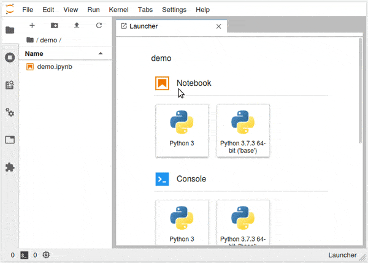

# jupyterlab-autoplay

A Jupyter Lab extension to automatically run and/or hide cells when opening a notebook.



## Requirements

* JupyterLab >= 2.0

## Install

```bash
jupyter labextension install jupyterlab-autoplay
```

## How to use

Find more details about how to use the extension in this [blog post](https://borgniet.com/?p=240).

TLDR:
1. Open or create a notebook
2. Edit it using `Set notebook autorun config` in the `command` pannel 
3. Save the notebook

### Configure the notebook manually
The extension reads the notebook's metadata to know if it should be ran on opening it. Which mean you can manually or programmatically edit the following metadata:
```
{
  [...]
  "metadata": {
    "autoplay": {
        "autoRun": true,
        "hideCodeCells": true
    }
  }
}
```

- *autoRun*: will run all the code cells in the notebook after opening it
- *hideCodeCells*: will hide code cells after opening it

## Warning
Be careful if you're using this extension as malicious code could be ran and hidden automatically. Make sure you and your users know what you're doing.

## Contributing

### Install

The `jlpm` command is JupyterLab's pinned version of
[yarn](https://yarnpkg.com/) that is installed with JupyterLab. You may use
`yarn` or `npm` in lieu of `jlpm` below.

```bash
# Clone the repo to your local environment
# Move to autoplay directory

# Install dependencies
jlpm
# Build Typescript source
jlpm build
# Link your development version of the extension with JupyterLab
jupyter labextension install .
# Rebuild Typescript source after making changes
jlpm build
# Rebuild JupyterLab after making any changes
jupyter lab build
```

You can watch the source directory and run JupyterLab in watch mode to watch for changes in the extension's source and automatically rebuild the extension and application.

```bash
# Watch the source directory in another terminal tab
jlpm watch
# Run jupyterlab in watch mode in one terminal tab
jupyter lab --watch
```

Now every change will be built locally and bundled into JupyterLab. Be sure to refresh your browser page after saving file changes to reload the extension (note: you'll need to wait for webpack to finish, which can take 10s+ at times).

### Uninstall

```bash
jupyter labextension uninstall jupyterlab-autoplay
```
